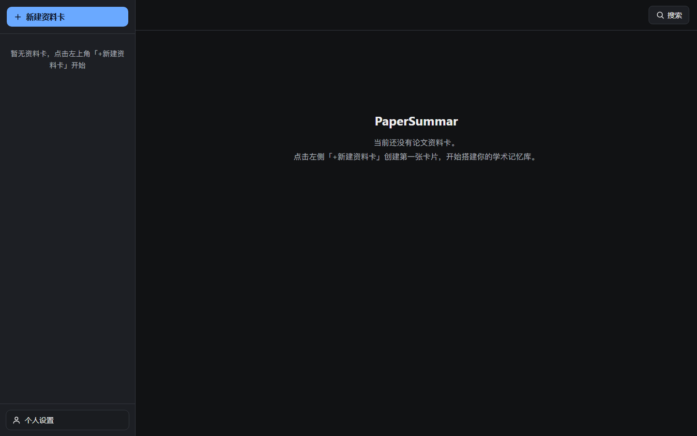
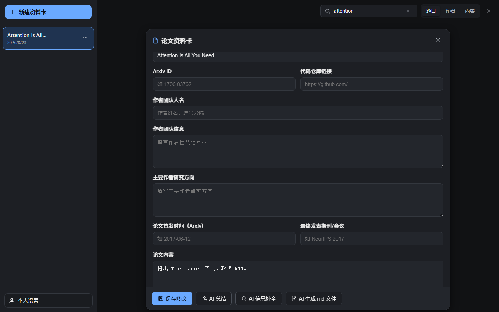

<div align="center">

# 📄 PaperSummar

**本地论文资料管理软件** — 以网页 GUI 管理论文资料卡，AI 联网补全、AI 总结、Markdown 导出，构建属于你的 **AI 学术记忆库**。


</div>

## 📸 界面预览

| 浅色主题 · 卡片编辑 | 深色主题 · 资料卡 |
|:---:|:---:|
|  |  |

## ✨ 功能

- 📇 **论文资料卡管理**：新建 / 打开 / 编辑 / 保存 / 删除，每篇论文一张卡片
- 🧩 **丰富字段**：论文题目、Arxiv ID、作者团队信息、研究方向、论文内容、创新点、代码仓库链接、首发时间、最终期刊/会议、个人感想、AI 总结
- 🌐 **AI 联网补全**：按题目 / Arxiv ID 联网搜索（arXiv API + DuckDuckGo），自动补全**未填写**的信息 —— **已填写的部分绝不会被 AI 删除或修改**
- ✍️ **AI 总结**：一键生成论文总结，写入「AI 总结」字段并随卡片保存
- 📝 **Markdown 导出**：严格按卡片内容生成 `.md` 文件，首行标注 `# 卡片ID`，方便多卡片 md 融合，直接作为 AI 学术记忆库
- 🔍 **多模式搜索**：按 题目 / 作者 / 内容 检索，结果实时显示在导航栏
- 🎨 **黑白双主题**：高对比度、字号适中，支持浅色 / 深色一键切换
- 📋 **任务进度条**：AI 操作以任务条形式显示进度；失败时展示错误信息并写入日志
- 💾 **本地存储**：所有数据保存在本地（默认 `data/` 目录），保存路径可在设置中修改，不上传任何云端

## 🛠 技术栈

| 层 | 技术 |
|---|---|
| 前端 | React 19 · Vite 6 · TypeScript · Zustand 5 |
| 后端 | Python 3.11+ · FastAPI · Uvicorn |
| 联网搜索 | arXiv API（免费免 Key）· DuckDuckGo（`ddgs`）兜底 |
| AI 接口 | OpenAI 兼容格式，支持自定义 `base_url` / `api_key` / `model` |
| 存储 | 本地 JSON 文件（每卡一个）+ Markdown 导出 |

## 🚀 快速开始

### 方式一：一键启动（推荐）

确保已安装 [Python 3.11+](https://www.python.org/downloads/) 与 [Node.js 20+](https://nodejs.org/)（首次运行需要 Node 构建前端，之后无需）。

```bash
# Windows（cmd）
start.bat

# Windows（PowerShell）
powershell -ExecutionPolicy Bypass -File start.ps1

# macOS / Linux
./start.sh
```

首次运行会自动：**探测 Python → 创建虚拟环境（`.venv`）→ 安装后端依赖 → 构建前端 → 启动服务**，并自动打开 `http://127.0.0.1:8000`。已完成的安装步骤会**自动跳过**，之后每次启动都是秒开。

> 💡 若不想安装 Node，可下载 GitHub **Release** 包（已内置构建好的 `frontend/dist`），同样一键启动。

### Python 探测顺序（Windows）

`start.bat` / `start.ps1` 会按以下顺序寻找可用的 Python：

1. 环境变量 `PAPERSUMMAR_PYTHON`（指向任意 `python.exe`，可手动指定）
2. `py -3` 启动器
3. `python`（必须是真实 Python，自动跳过 Microsoft Store 的假 python）
4. 常见 conda 安装路径

> ⚠️ **常见问题**：Windows 上很多机器 PATH 里的 `python` 其实是 Microsoft Store 的占位程序（`WindowsApps\python.exe`），运行时会报「系统找不到指定的路径」。遇到此报错时，安装 [python.org](https://www.python.org/downloads/) 的官方 Python 并勾选 *Add to PATH*，或设置环境变量 `PAPERSUMMAR_PYTHON` 指向真实 `python.exe` 后重新运行。

### 启动流程说明

`start.bat` / `start.ps1` / `start.sh` 只负责**探测可用的 Python**，实际的安装与启动逻辑统一在 `scripts/launch.py`（三个平台共用一份，行为一致）：

1. 探测 Python（见上）→ 调用 `scripts/launch.py`
2. 创建虚拟环境 `.venv`（已存在则跳过）
3. 安装后端依赖（已安装过会跳过，由 `.venv/.papersummar_ready` 标记控制）
4. 若缺少 `frontend/dist`，用 npm 构建前端
5. 打开浏览器并启动服务 `http://127.0.0.1:8000`

> 把安装与启动逻辑放在 Python 中，是为了避开各平台 shell（尤其 Windows cmd）的解析陷阱，并保证跨平台一致性与可维护性。技术熟练的用户也可以直接运行 `python scripts/launch.py` 获得同样效果。

### 方式二：手动安装

```bash
# 1. 后端
python -m venv .venv
# Windows: .venv\Scripts\activate    macOS/Linux: source .venv/bin/activate
pip install -e .

# 2. 前端
cd frontend
npm install
npm run build
cd ..

# 3. 启动
python -m uvicorn app.main:app --host 127.0.0.1 --port 8000 --app-dir backend
```

### 开发模式（前后端热更新）

```bash
python scripts/dev.py
# 前端 http://127.0.0.1:5173 （/api 自动代理到 8000）
```

## ⚙️ 使用说明

1. 点击左侧 **「+新建资料卡」** 创建论文卡片。
2. 填写论文题目并点击 **「保存修改」**（**填写并首次确认保存后，才启用 AI 相关功能**），可同时填写 Arxiv ID。
3. 点击卡片右下角：
   - **保存修改**：保存当前编辑内容（不关闭卡片）
   - **AI 信息补全**：联网搜索并补全未填字段（已填内容绝不被覆盖）
   - **AI 总结**：生成总结写入「AI 总结」字段
   - **AI 生成 md 文件**：按卡片内容导出 Markdown
4. 左下角 **个人设置** 中配置：个人名称、API Key（OpenAI 格式）、Base URL、模型、数据保存路径、主题。

### AI 补全「绝不覆盖已填内容」的保证

AI 补全采用**服务端严格合并**：AI 生成的任何内容只有在对应字段**为空**时才会被填入；已填写的字段、以及「个人感想」，无论 AI 返回什么都被原样保留。该逻辑有单元测试覆盖（`backend/tests/test_ai_pipeline.py`）。

### 支持的 AI 接口

仅支持 OpenAI 格式，兼容官方及各类中转 / 代理服务：

- **Base URL**：如 `https://api.openai.com/v1`，或中转地址
- **API Key**：官方或中转提供的 key（注意**完整复制**，如 DeepSeek 的 key 以 `sk-` 开头、约 35 字符）
- **模型**：任意可用模型名（如 `gpt-4o-mini`、`deepseek-chat` 等）

> 💡 使用 DeepSeek 官方 API 时，模型名通常是 `deepseek-chat` 或 `deepseek-reasoner`；若用中转服务，以该服务文档为准。

#### 常见报错与排查

- **401 / API Key 无效**：服务端拒绝认证。确认 key 完整复制、Base URL 与 key 来自同一服务商，并到「个人设置」重新保存。
- **429 / 限流**：请求频率过高或账户余额不足，稍后重试。
- 以上错误会以**友好中文提示**显示在右下角任务条中，并记录到 `data/logs/tasks.log`（详见 FAQ）。

## ❓ 常见问题（FAQ）

**Q：双击 `start.bat` 提示「系统找不到指定的路径」？**
A：PATH 里的 `python` 是 Microsoft Store 的占位程序。安装官方 Python 并勾选 *Add to PATH*，或设置环境变量 `PAPERSUMMAR_PYTHON` 指向真实 `python.exe` 后重试（详见上文「Python 探测顺序」）。

**Q：AI 补全 / 总结失败，任务条提示「API Key 无效或已过期」？**
A：按「支持的 AI 接口」一节核对：key 是否**完整复制**、Base URL 与 key 是否来自同一服务商、模型名是否在该服务有效。

**Q：arXiv 联网搜索很慢或未命中？**
A：arXiv API 在部分网络环境下访问受限（超时）。程序会自动降级为 DuckDuckGo 搜索 + LLM 推理来补全，不影响其余字段。

**Q：在哪里查看详细报错？**
A：任务失败会在右下角任务条展开错误信息，同时写入 `data/logs/tasks.log` 与 `data/logs/app.log`。

**Q：我改了代码，改动怎么生效？**
A：后端代码是热加载的 editable 安装，重启后端（关闭窗口重新运行 `start.bat`）即可；前端改动需在 `frontend/` 下执行 `npm run build` 后重启。

## 📂 数据目录结构

```
data/                      # ★ 本地数据（不会提交到 Git）
├── cards/                 # 每篇论文一个 JSON 文件
│   └── card_20260823_..._xxxx.json
├── exports/               # AI 生成的 Markdown 文件
│   └── card_20260823_..._xxxx.md
├── logs/
│   ├── app.log            # 运行日志
│   └── tasks.log          # AI 任务失败日志
└── config.json            # 个人设置（含 API Key，仅保存在本地）
```

> 卡片 ID 格式为 `card_YYYYMMDD_HHMMSS_随机`，md 文件首行 `# 卡片ID` 即为该 ID，可作为多卡片融合时的稳定锚点。

### 数据路径支持相对路径，移动文件夹不丢数据

「个人设置」中的**保存路径**支持**相对路径**（以项目根目录为基准，如 `data`）与**绝对路径**：

- **相对路径（推荐）**：剪切 / 移动整个项目文件夹后，数据自动跟随到新位置，不会丢失。
- 若填写项目**内部的绝对路径**，保存时会自动转换为相对路径存储。
- 项目**外部**的绝对路径（如 `D:\mydata`）保持不变，数据存储于该固定位置。

## 🔒 安全与隐私

- 所有数据（含 API Key）**仅存储在本地**，服务只绑定 `127.0.0.1`，不对外网开放。
- 前端只展示掩码后的 API Key（如 `sk-****abcd`），需重新输入才会更新。
- 卡片文本一律以文本节点渲染，不执行任何注入内容。
- 请自行评估中转服务的可靠性；泄露风险自负。

## 🤝 贡献

欢迎提 Issue 与 PR！请先阅读 [CONTRIBUTING.md](CONTRIBUTING.md)。

## 📄 License

[MIT](LICENSE)

---

<div align="center">Made with ❤️ for researchers</div>
